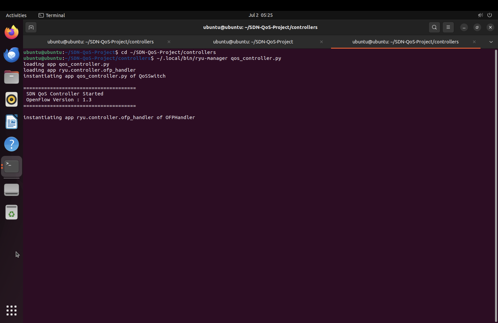
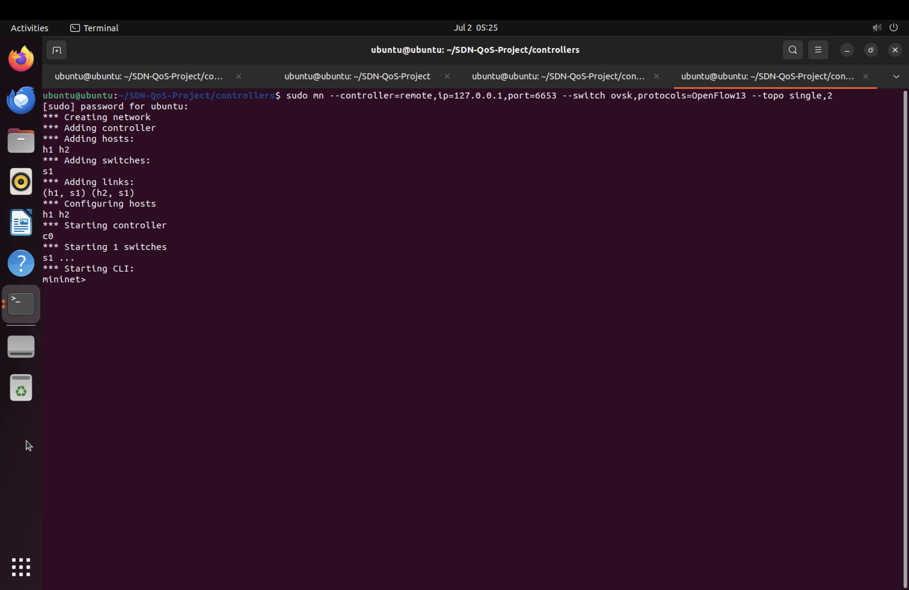
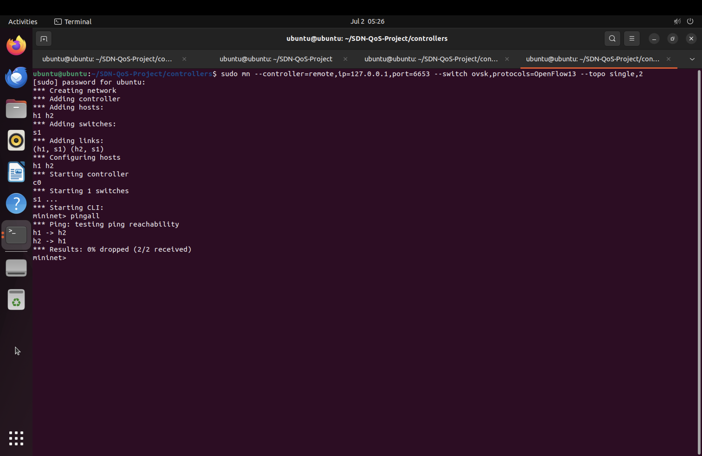
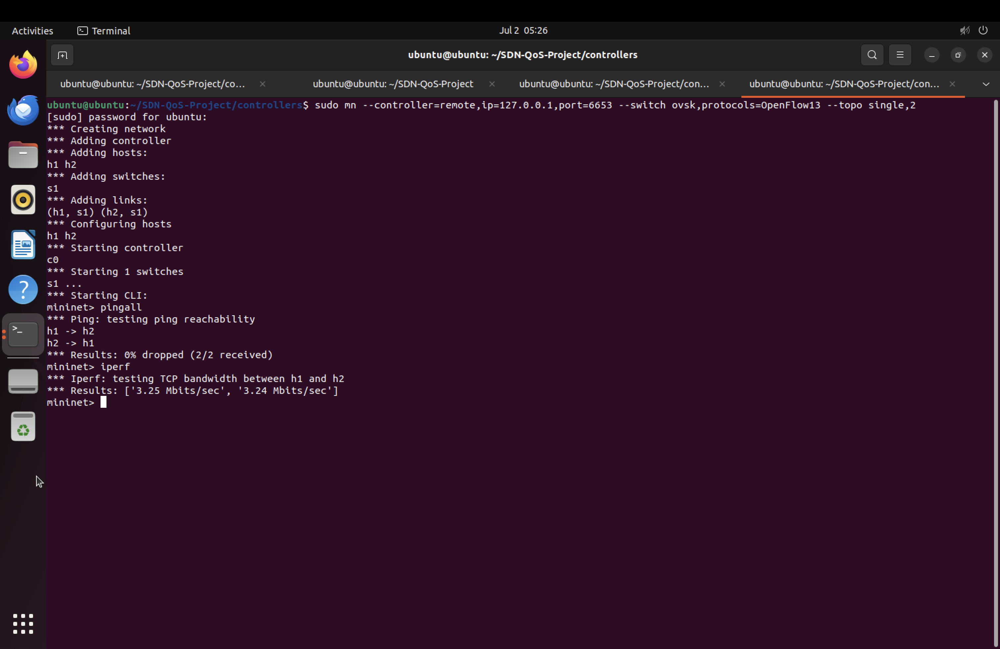
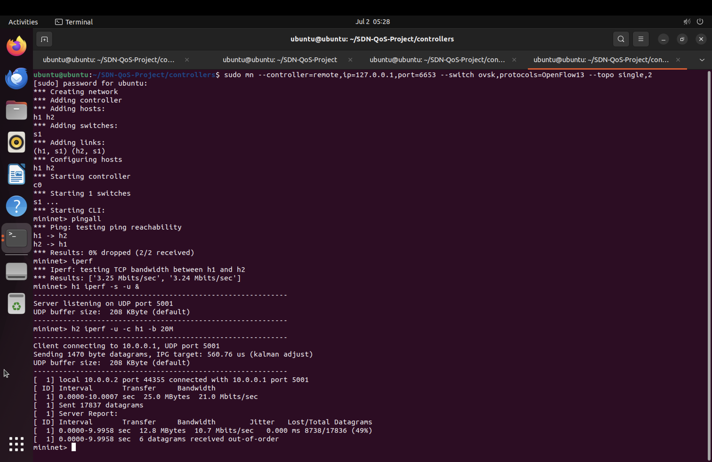
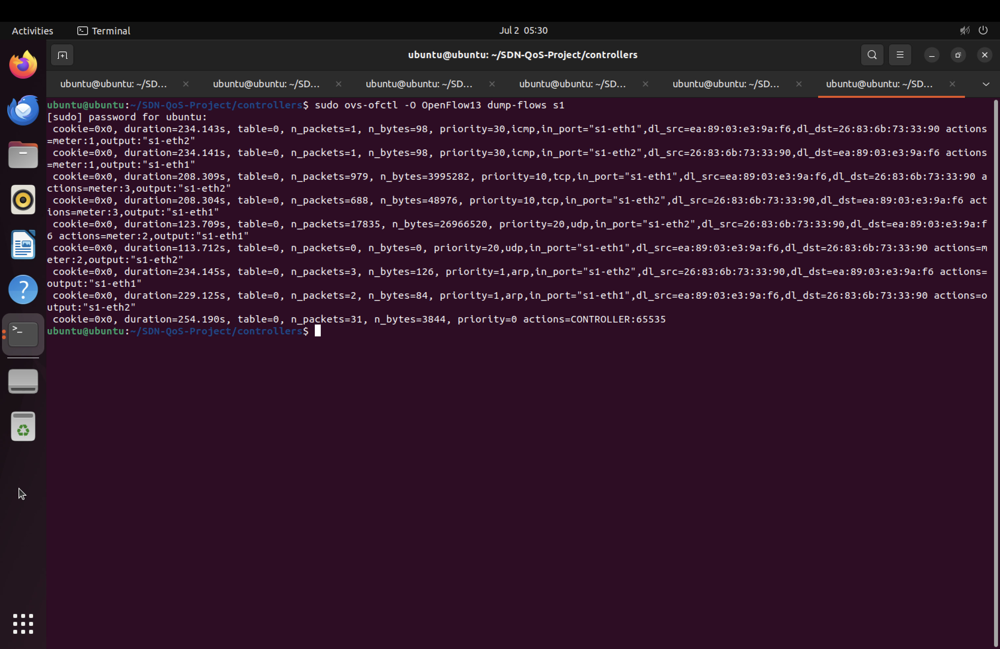
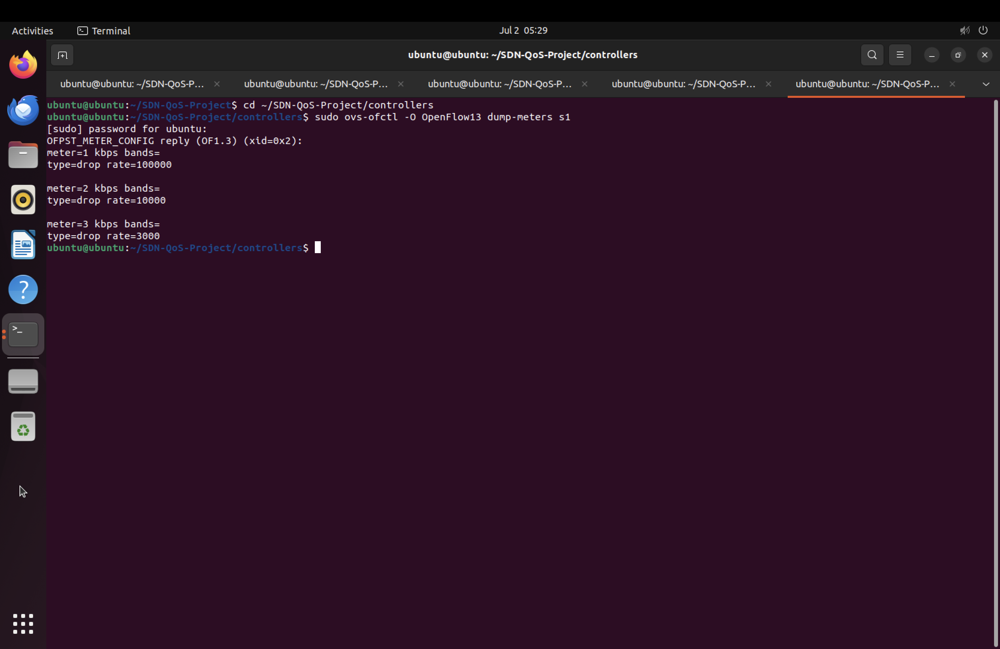
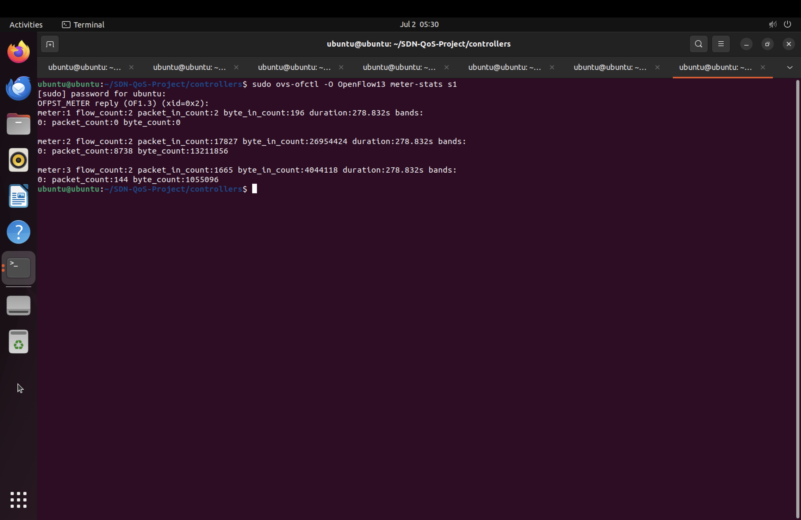
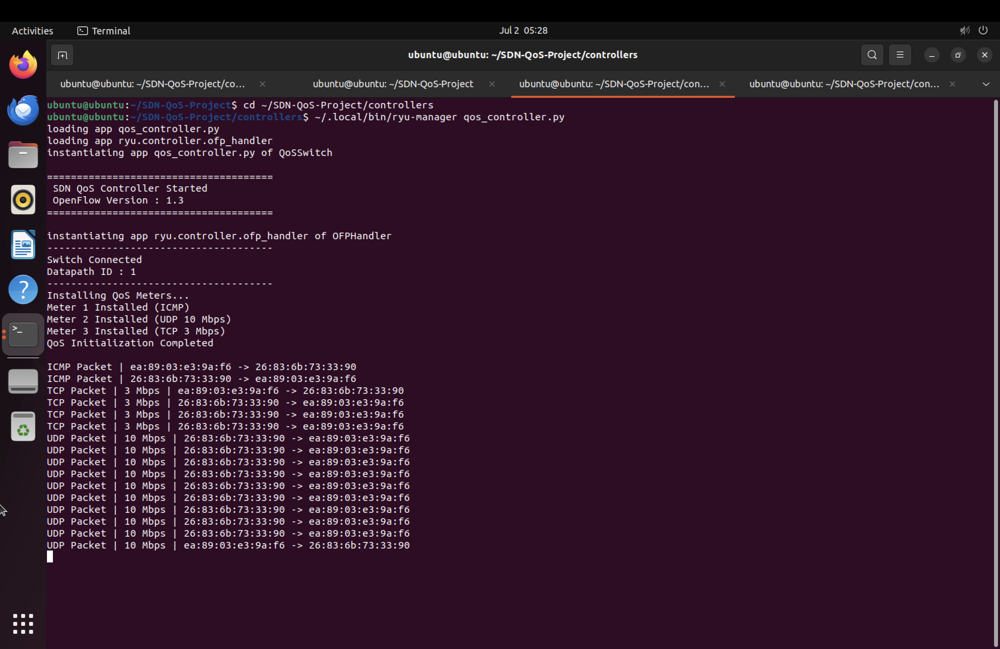

# 🚀 SDN QoS Using Ryu Controller
    

An SDN (Software Defined Networking) project that implements **Quality of Service (QoS)** using the **Ryu SDN Controller**, **Open vSwitch**, and **Mininet**. The controller classifies traffic into different protocols (ICMP, TCP, UDP) and applies different bandwidth limits using OpenFlow 1.3 meters.

---

## 📌 Features

- ✅ OpenFlow 1.3 based Ryu Controller
- ✅ Dynamic packet classification
- ✅ Protocol-aware QoS
- ✅ Meter Table configuration
- ✅ ICMP traffic prioritization
- ✅ TCP bandwidth limiting (3 Mbps)
- ✅ UDP bandwidth limiting (10 Mbps)
- ✅ Dynamic flow installation
- ✅ Real-time packet logging
- ✅ Mininet topology support

---

# 🛠 Technologies Used

- Python 3
- Ryu SDN Controller
- OpenFlow 1.3
- Open vSwitch (OVS)
- Mininet
- Ubuntu 20.04

---

# 📂 Project Structure

```
SDN-QoS-Using-Ryu
│
├── controllers/
│   └── qos_controller.py
│
├── screenshots/
│   ├── controller-start.png
│   ├── switch-connected.png
│   ├── ping-test.png
│   ├── tcp-test.png
│   ├── udp-test.png
│   ├── flow-table.png
│   ├── dump-meters.png
│   ├── meter-stats.png
│   └── controller-logs.png
│
├── topology/
├── traffic/
├── requirements.txt
├── LICENSE
└── README.md
```

---

# 🌐 Network Topology

```
        +-----------------------+
        |    Ryu Controller     |
        +-----------+-----------+
                    |
             OpenFlow 1.3
                    |
              +-----+-----+
              |    OVS    |
              |    s1      |
              +--+-----+---+
                 |     |
               h1       h2
```

---

# ⚙️ QoS Policy

| Protocol | Meter ID | Bandwidth |
|----------|----------|-----------|
| ICMP | 1 | High Priority |
| UDP | 2 | 10 Mbps |
| TCP | 3 | 3 Mbps |

---

# 🚀 Running the Project

## Start the Controller

```bash
cd controllers
~/.local/bin/ryu-manager qos_controller.py
```

---

## Start Mininet

```bash
sudo mn \
--topo single,2 \
--switch ovs,protocols=OpenFlow13 \
--controller remote,ip=127.0.0.1,port=6653
```

---

# 🧪 Testing

## Ping Test

```bash
pingall
```

---

## TCP Test

```bash
iperf
```

---

## UDP Test

```bash
h1 iperf -s -u &
h2 iperf -u -c h1 -b 20M
```

---

# 📊 Results

## Controller Startup



---

## Switch Connected



---

## Ping Test



---

## TCP QoS



---

## UDP QoS



---

## Flow Table



---

## Installed Meters



---

## Meter Statistics



---

## Controller Packet Logs



---

# 📈 Verification

The implementation successfully demonstrates:

- Dynamic packet classification
- OpenFlow Meter Table configuration
- Bandwidth limitation using meters
- Protocol-specific flow installation
- Traffic prioritization
- Real-time packet monitoring

---

# 📄 License

This project is licensed under the MIT License.

---

# 👨‍💻 Author

**Shahith J**

Cyber Security Enthusiast

GitHub: https://github.com/ShahithJ

---
